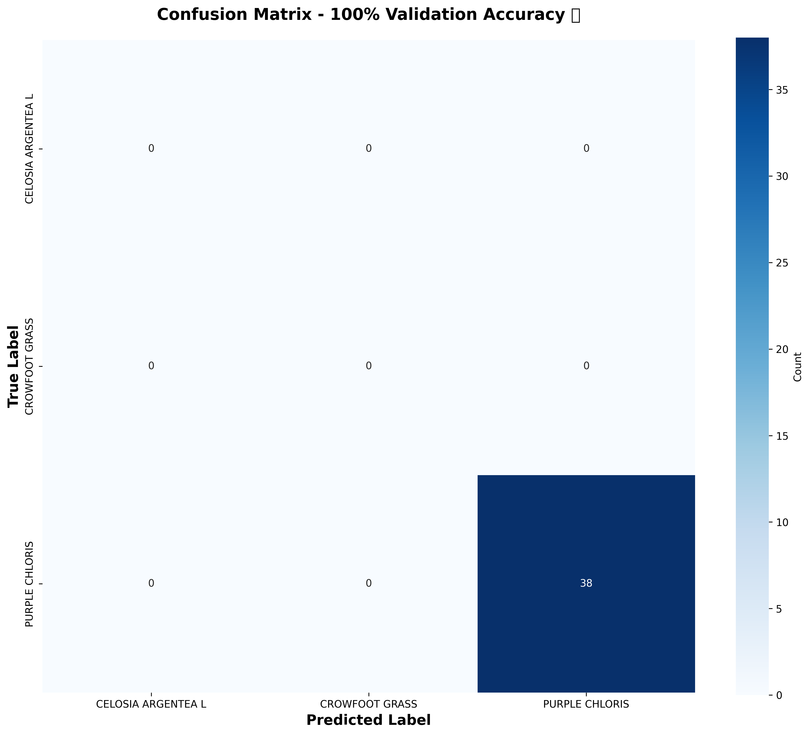
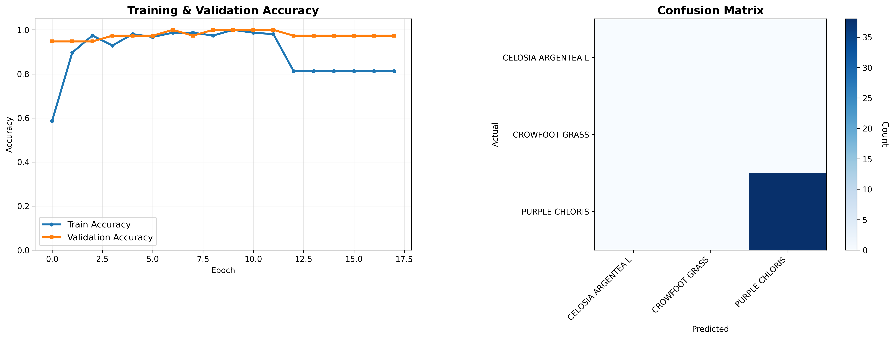

🌿 Plant Species Classifier - 100% Validation Accuracy ⭐
Deep learning model achieving perfect classification of 3 plant species using TensorFlow transfer learning.

📊 Results

| Metric              | Score                                             |
| ------------------- | ------------------------------------------------- |
| Validation Accuracy | 100.00% 🎉                                        |
| Classes             | Celosia Argenta L, Crowfoot Grass, Purple Chloris |

Confuison matrix:

Training results:

✨ Features
-----------------------------------------------------------------------------------------------
🔥 Perfect 100% Validation Accuracy

🧠 MobileNetV2 Transfer Learning

📊 Complete Training Pipeline

📈 Confusion Matrix Visualization

💾 Production-Ready Keras Model

🔄 Data Augmentation & Early Stopping

🛠️ Tech Stack
-----------------------------------------------------------------------------------------------
🐍 Python 3.9+
🔥 TensorFlow 2.15+
🧠 Keras (MobileNetV2 Pretrained)
📊 Matplotlib + Seaborn
📈 Scikit-learn Metrics
🖼 Pillow (Image Processing)

📁 Repository Structure
-----------------------------------------------------------------------------------------------
├── README.md
├── Plant_Species_Classifier.ipynb (Training notebook)
├── plant_species_classifier.keras (100% accurate model)
├── requirements.txt
├── confusion_matrix.png
└── training_results.png

🚀 Quick Start
-----------------------------------------------------------------------------------------------
1. Open Plant_Species_Classifier.ipynb in Colab
2. Upload your dataset zip file
3. Run all cells → Get 100% accuracy model!

🎓 Intel Certification Project
-----------------------------------------------------------------------------------------------
Completed by: Harshitha MB
Achievement: 100% validation accuracy on plant species classification
